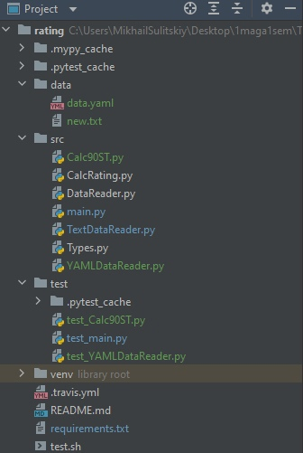
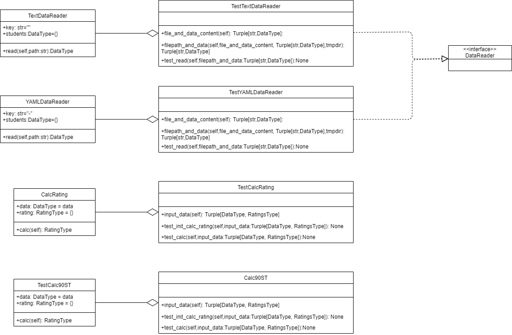

# PTLab1
Лабораторная №1 по дисциплине "Технологии программирования"
Лабораторная 1 по дисциплине "Технологии программирования
# Цель работы
Определить и вывести на экран студента, имеющего 90 баллов по всем дисциплинам. Если таких студентов несколько, нужно вывести любого из них. Если таких студентов нет, необходимо вывести сообщение об их отсутствии. Формат - YAML
# Структура

# UML

# Пакеты
pytest - тестирование
mypy - корректность работы с типами
pycodestyle - соответствие кода стандарту РЕР-8
pyyaml - модуль для работы с yaml
types-PyYAML - корректность работы с типами (аналог mypy)
# Выводы
Получены навыки работы с системой Git для хранения и управления версиями ПО;
Получены навыки разработки ООП-программ и написания модульных тестов к ним на современных языках программирования;
Закреплены понятия «непрерывная интеграция» (CI) и «непрерывное развертывание» (CD), определено их место в современной разработке программного обеспечения;
# P.S.

